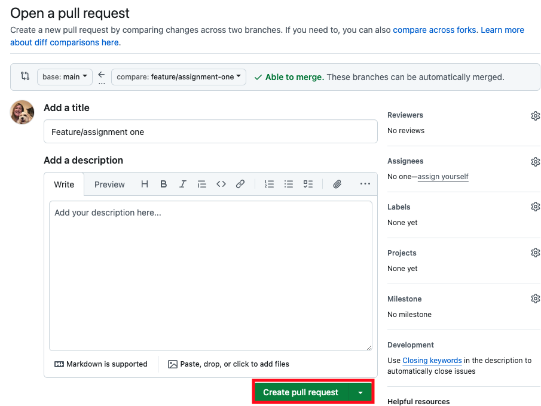
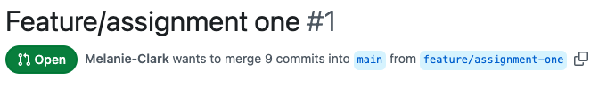
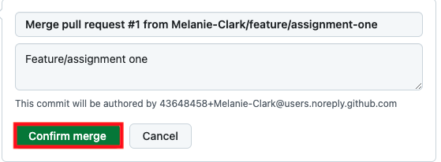

# Assignment One

## About Me
Currently a Clinical System Project Lead & Analyst, I'm really excited about the CFGDegree and looking forward to switching careers into Software Engineering.

**Skills include:** `Configuration`, `Training`, `Template Design and Development`, `Reporting`, `Implementation`, `Project Leadership`

**Clinical Systems:** `EMIS` `SystmOne`

In 2003, I completed a Diploma in Computing (C++) with The Open University. I had no idea what jobs to apply for back then or what was possible, but it led me to a varied and exciting career within the NHS.

Thanks to CFG, my passion for coding has been reignited and given me the confidence to move forward towards my dream role :smile:.

Overall, I have a strong passion for problem-solving and simplifying processes both internally and for the end-user.

[](https://www.linkedin.com/in/melanie-clark-3b948118/)


### CFG Courses
I've recently completed the **CFG Python and Apps Kickstarter** where my code partner and I developed a Pokémon Top Trumps game.

Other CFG courses completed:
- Intro to Coding
- Intro to 


### Interests
I enjoy going to the theatre, and have also been known to do a spot of acting!

My little Cavachon, Fleur, also keeps me busy and entertained. She loves her tricks and a bit of doggie dancing.\
(_Although she loves rewards, so we have to keep stopping for treats_ :dog: :laughing:!)


[Fleur videos](Fleur_videos.md)


---

## GitHub and PyCharm
In this assignment, I'll be using GitHub to submit my assignment and track progress and history using version control.


**GitHub** and **PyCharm** will be used for the following purposes:

<ins>**GitHub:**<ins>

- Initial set-up:
  - Creating a private repository
  - Adding assigned collaborators


- Pull request:
  - Opening a Pull Request
  - Merging and deploying to the Main branch


<ins>**PyCharm:**<ins>

- Initial set-up and commit:
  - Cloning the repository
  - Removing `#` from `.idea` in the `.gitignore` file\
  _(For existing repositories, it's also good practice to update the Main branch before creating a new branch)_
  - Creating a branch
  - Creating new directories and files
  - Writing this README file
  - Checking git status
  - Add changes to staging
  - Commit changes with a meaningful message including filename(s) where appropriate
  - Push changes to remote
  

- Checking changes from Main:
  - Fetch any remote updates
  - Pull/Update changes from the main branch
  - Merge changes from main into local branch
---
## Git and GitHub Workflow
_Please note: Additional screenshots and terminal lines have been added to ensure all requirements are met and nothing is missed. I apologise that some of the screenshots may not flow in terms of the same filename, I don't think this is a requirement, but if in a work environment I would ensure these flowed better. Sample filenames are provided in the command lines_

### Checking the status

```
git status
```

**Terminal:** Below is an example of an early git status when no changes have been made to the repository:

.png) 

Further examples of checking the status are shown in screenshots further down.

**PyCharm:** Check the status by opening the `Commit` window.

The below shows an example of unstaged changes:

.png) 

### Creating a branch
When creating a branch, it's important to state which kind of branch e.g. **Feature, Bugfix, Release, Hotfix**

```
git checkout -b feature/assignment-one
```

_Note: **checkout** immediately switches to the branch_

**Terminal:**

.png) 

**PyCharm:**

.png)

.png)

### Adding files to a branch

Before adding files to a branch, you may wish to add a new file. To do so, ensure the branch is selected/checked out and that you're on the right directory:

**Check list of directories and files:** 
```
ls
```

**Change directory:** 
```
cd Assignment-01
```

**Create a new file:** 
```
touch README.md
```

**ADD A FILE TO A BRANCH (staging)** 
```
git add README.md
```

**ADD ALL FILES TO A BRANCH  (staging)** 
```
git add .
```

<ins>**Terminal:**<ins>

.png)  

<ins>**PyCharm:**<ins>

**Creating the file:**

.png)\
.png)\
**ADDING THE FILE TO GIT (staging):**

.png)

### Adding commits with meaningful messages

**Commit:** 
```
git commit -m "Assignment-01 README.md added"
```
**Push to remote:** 
```
git push
```

**Terminal:**

.png) 

**PyCharm:**\
You can select `Commit` or `Commit and Push`, the latter would push the branch to remote.

.png) 


### Opening a pull request
1. Navigate to the **GitHub repository**.
  
2. Click on `Pull requests` - `New pull request` or
   click on `Compare & pull request` if available.
   
  

3. Select the _branch_ to merge into main and `Create pull request`.

  

4. Click on `Create pull request` to open a new pull request.



5. This is now an **Open** pull request.



### Merging and deploying to main branch
6. If there are no conflicts, click on `Merge pull request`.

  

7. Click on `Confirm merge` to deploy to main.

  

### Additional Good Practice
It's also good practice before adding/editing to a branch, to check for updates on Main and merge into your branch.

#### Pycharm:
- Click on the `Fetch` icon on the left toolbar.
- Right-click on a branch, and click `Update`.
- Click `Merge 'main' into 'feature/assignment-one`
- 
  

---
## Additional Requirements

<ins>**.gitignore**<ins>

A .gitignore file has been created in the root of this repository. 

This is a special file containing specified directories or files which will be ignored _(not tracked or committed)_ by Git such as `.idea`.

Other useful examples of files to ignore are temporary files and sensitive files such as passwords that shouldn't be shared or committed to the repository.

This ensures the repository is focussed on the important aspects of the project and not cluttered with unnecessary files.

<ins>**requirements.txt**<ins>

A requirements.txt file has been added to the root of the repository. 

The requirements file lists all the dependencies/library items to be installed by pip for the project to run and to be reproduced. 

It may also include version numbers e.g. numpy==1.9.2.